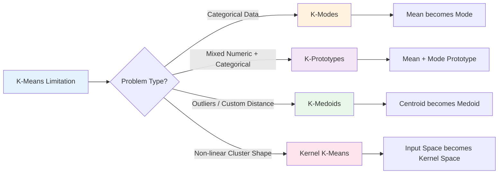
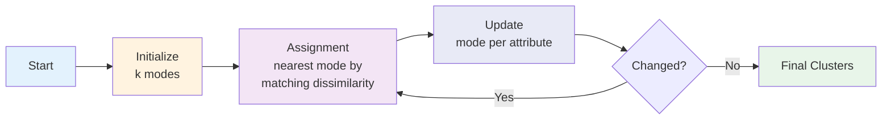
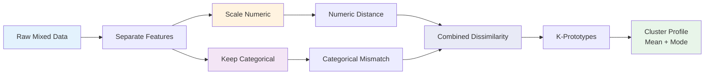
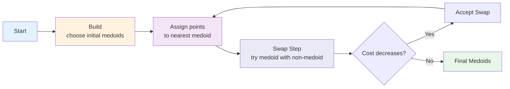
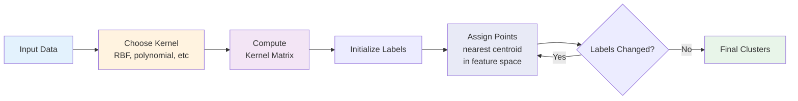
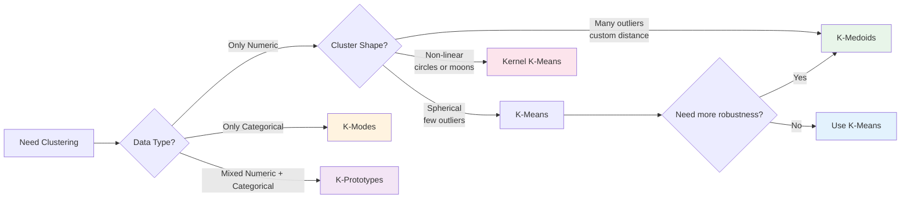

# Extensions of K-Means: K-Modes, K-Prototypes, K-Medoids, Kernel K-Means

## Tujuan Pembelajaran

Setelah mempelajari materi ini, mahasiswa mampu:

1. Menjelaskan keterbatasan K-Means pada categorical, mixed, outlier, dan non-linear data
2. Menjelaskan cara kerja K-Modes untuk categorical clustering
3. Menjelaskan cara kerja K-Prototypes untuk mixed numeric-categorical clustering
4. Menjelaskan K-Medoids sebagai robust alternative to K-Means
5. Menjelaskan Kernel K-Means untuk non-linear cluster structure
6. Memilih metode clustering yang sesuai berdasarkan tipe data dan bentuk cluster

## Daftar Isi

1. [Recap: Why K-Means is Not Enough](#1-recap-why-k-means-is-not-enough)
2. [K-Modes: K-Means for Categorical Data](#2-k-modes-k-means-for-categorical-data)
3. [K-Prototypes: Mixed Numeric and Categorical Data](#3-k-prototypes-mixed-numeric-and-categorical-data)
4. [K-Medoids: Robust Representative-Based Clustering](#4-k-medoids-robust-representative-based-clustering)
5. [Kernel K-Means: Non-Linear Clustering](#5-kernel-k-means-non-linear-clustering)
6. [Comparison and Decision Guide](#6-comparison-and-decision-guide)
7. [Evaluation and Practical Tips](#7-evaluation-and-practical-tips)
8. [Latihan](#8-latihan)
9. [Referensi](#referensi)

---

## 1. Recap: Why K-Means is Not Enough

### K-Means Works Well When

K-Means cocok jika data memenuhi kondisi berikut:

- Semua fitur **numeric**
- Cluster roughly **spherical / convex**
- Ukuran cluster relatif seimbang
- Tidak banyak outlier
- Euclidean distance meaningful
- Jumlah cluster `k` sudah dapat diperkirakan

### K-Means Fails When

Dalam real-world data, asumsi di atas sering tidak terpenuhi.

| Masalah | Contoh Data | Kenapa K-Means Bermasalah |
|---|---|---|
| Categorical data | gender, kota, brand, kategori produk | Mean dari kategori tidak meaningful |
| Mixed data | umur + income + kota + pekerjaan | Numeric dan categorical butuh distance berbeda |
| Outlier | customer dengan spending ekstrem | Centroid tertarik outlier |
| Non-linear cluster | circles, moons, rings | Euclidean centroid membuat boundary linear/spherical |

### Extension Map



**Key idea:** Setiap extension tetap membawa spirit K-Means: assign point ke representative terdekat, lalu update representative cluster.

Bedanya ada di:

- tipe representative cluster
- definisi distance / dissimilarity
- tipe data yang bisa ditangani

---

## 2. K-Modes: K-Means for Categorical Data

### 2.1 Motivasi

K-Means tidak cocok untuk nominal categorical data.

Contoh fitur kategorikal:

```text
warna = red, blue, green
ukuran = small, medium, large
bahan = cotton, denim, polyester
```

Pertanyaan penting:

```text
mean(red, blue, green) = ?
```

Tidak ada jawaban yang meaningful.

Encoding kategori menjadi angka juga misleading:

```text
red = 1, blue = 2, green = 3
mean(red, green) = 2 = blue
```

Padahal `blue` tidak harus berada di tengah `red` dan `green`.

### 2.2 Big Idea

K-Modes mengganti tiga komponen utama K-Means:

| K-Means | K-Modes |
|---|---|
| Numeric data | Categorical data |
| Mean / centroid | Mode |
| Euclidean distance | Simple matching dissimilarity |

**Mode** adalah kategori yang paling sering muncul pada suatu atribut.

Contoh:

```text
Cluster warna: red, red, blue, red, green
Mode warna = red
```

### 2.3 Simple Matching Dissimilarity

Untuk dua categorical objects `X` dan `Y`:

```text
d(X, Y) = Σⱼ δ(xⱼ, yⱼ)

δ(xⱼ, yⱼ) = 0 jika xⱼ = yⱼ
            1 jika xⱼ ≠ yⱼ
```

Contoh:

```text
X = [red, small, cotton]
Y = [red, large, cotton]

d(X, Y) = 0 + 1 + 0 = 1
```

Interpretasi:

- Semakin kecil nilai `d`, semakin mirip dua objek
- `d = 0` berarti semua kategori sama
- `d = jumlah fitur` berarti semua kategori berbeda

### 2.4 Objective Function

K-Modes meminimalkan total mismatch antara object dan mode cluster-nya.

```text
Minimize:
P(W, Q) = Σₗ₌₁ᵏ Σᵢ₌₁ⁿ wᵢₗ d(Xᵢ, Qₗ)

where:
- Xᵢ = data object ke-i
- Qₗ = mode cluster ke-l
- wᵢₗ = 1 jika Xᵢ masuk cluster l, else 0
- d(Xᵢ, Qₗ) = matching dissimilarity
```

### 2.5 Algorithm



**Langkah:**

1. Pilih `k` initial modes
2. Assign setiap object ke mode terdekat
3. Untuk setiap cluster, update mode tiap atribut
4. Ulangi assignment-update sampai tidak ada perubahan cluster

### 2.6 Contoh Manual

Dataset customer sederhana:

| Customer | Kota | Device | Paket |
|---|---|---|---|
| C1 | Surabaya | Android | Basic |
| C2 | Surabaya | Android | Basic |
| C3 | Surabaya | iOS | Premium |
| C4 | Jakarta | iOS | Premium |
| C5 | Jakarta | iOS | Premium |
| C6 | Jakarta | Android | Basic |

Misal `k=2`, mode awal:

```text
Q1 = [Surabaya, Android, Basic]
Q2 = [Jakarta, iOS, Premium]
```

Hitung dissimilarity C3:

```text
C3 = [Surabaya, iOS, Premium]

d(C3, Q1) = 0 + 1 + 1 = 2
d(C3, Q2) = 1 + 0 + 0 = 1

C3 assigned to Cluster 2
```

Update mode Cluster 2 jika berisi C3, C4, C5:

```text
Kota   = mode(Surabaya, Jakarta, Jakarta) = Jakarta
Device = mode(iOS, iOS, iOS) = iOS
Paket  = mode(Premium, Premium, Premium) = Premium
```

### 2.7 Implementasi Python

```python
import pandas as pd
from kmodes.kmodes import KModes

X = pd.DataFrame({
    "kota": ["Surabaya", "Surabaya", "Surabaya", "Jakarta", "Jakarta", "Jakarta"],
    "device": ["Android", "Android", "iOS", "iOS", "iOS", "Android"],
    "paket": ["Basic", "Basic", "Premium", "Premium", "Premium", "Basic"],
})

km = KModes(n_clusters=2, init="Huang", n_init=5, random_state=42)
labels = km.fit_predict(X)

print(labels)
print(km.cluster_centroids_)
```

### 2.8 Pros and Cons

| Pros | Cons |
|---|---|
| Cocok untuk nominal categorical data | Tetap harus memilih `k` |
| Mode mudah diinterpretasikan | Sensitive to initialization |
| Tidak perlu fake numeric encoding | Simple matching terlalu sederhana |
| Scalable untuk data besar | Semua atribut dianggap sama penting |
| Cluster profile jelas | Tidak menangkap semantic similarity antar kategori |

### 2.9 Best Practice

- Gunakan `init="Huang"` atau `init="Cao"`, bukan hanya random
- Gunakan `n_init > 1` untuk stabilitas
- Impute missing values sebelum clustering
- Jangan pakai label encoding + K-Means untuk nominal categories
- Gabungkan kategori yang terlalu rare jika high-cardinality
- Interpretasi hasil melalui **cluster mode profile** dan distribution per cluster

---

## 3. K-Prototypes: Mixed Numeric and Categorical Data

### 3.1 Motivasi

Banyak dataset bisnis punya fitur numeric dan categorical sekaligus.

Contoh customer segmentation:

| Customer | Age | Income | City | Membership |
|---|---:|---:|---|---|
| C1 | 21 | 4.5 | Surabaya | Basic |
| C2 | 24 | 5.0 | Surabaya | Basic |
| C3 | 35 | 12.0 | Jakarta | Premium |

K-Means hanya cocok untuk `Age` dan `Income`.

K-Modes hanya cocok untuk `City` dan `Membership`.

**K-Prototypes** menggabungkan keduanya.

### 3.2 Big Idea

K-Prototypes memakai prototype cluster yang terdiri dari:

- **mean** untuk numeric attributes
- **mode** untuk categorical attributes

Contoh prototype:

```text
Cluster 1 prototype:
Age = 23.4
Income = 5.1 juta
City = Surabaya
Membership = Basic
```

### 3.3 Combined Dissimilarity

Untuk mixed-type objects:

```text
d(X, Q) = Σ_numeric (xⱼ - qⱼ)² + γ Σ_categorical δ(xⱼ, qⱼ)
```

where:

- Numeric part = squared Euclidean distance
- Categorical part = matching dissimilarity
- `γ` atau gamma = weight untuk categorical mismatch

### 3.4 Objective Function

```text
Minimize:
P(W, Q) = Σₗ₌₁ᵏ Σᵢ₌₁ⁿ wᵢₗ [
    Σⱼ₌₁ᵖ (xᵢⱼ - qₗⱼ)²
    + γ Σⱼ₌ₚ₊₁ᵐ δ(xᵢⱼ, qₗⱼ)
]
```

where:

- `p` = jumlah numeric attributes
- `m-p` = jumlah categorical attributes
- `γ` = balance numeric cost dan categorical cost

### 3.5 Role of Gamma

Gamma adalah parameter paling penting di K-Prototypes.

```text
Total distance = numeric distance + gamma × categorical mismatch
```

| Gamma | Dampak |
|---:|---|
| Terlalu kecil | Categorical features hampir diabaikan |
| Terlalu besar | Numeric features kalah dominan |
| Seimbang | Numeric dan categorical sama-sama berpengaruh |

**Intuisi:** gamma adalah “harga” satu mismatch kategori.

### 3.6 Pipeline



### 3.7 Algorithm

1. Tentukan numeric dan categorical columns
2. Scale numeric columns
3. Pilih `k` initial prototypes
4. Assign setiap data ke prototype terdekat berdasarkan combined dissimilarity
5. Update prototype:
   - numeric features → mean
   - categorical features → mode
6. Repeat sampai cluster stabil

### 3.8 Implementasi Python

```python
import pandas as pd
from sklearn.preprocessing import StandardScaler
from kmodes.kprototypes import KPrototypes

df = pd.DataFrame({
    "age": [21, 24, 35, 42, 23, 40],
    "income": [4.5, 5.0, 12.0, 13.5, 4.8, 12.8],
    "city": ["Surabaya", "Surabaya", "Jakarta", "Jakarta", "Surabaya", "Jakarta"],
    "membership": ["Basic", "Basic", "Premium", "Premium", "Basic", "Premium"],
})

numeric_cols = ["age", "income"]
categorical_cols = ["city", "membership"]

scaler = StandardScaler()
df_scaled = df.copy()
df_scaled[numeric_cols] = scaler.fit_transform(df[numeric_cols])

X = df_scaled[numeric_cols + categorical_cols].to_numpy()
categorical_idx = [2, 3]

kp = KPrototypes(n_clusters=2, init="Huang", n_init=5, random_state=42)
labels = kp.fit_predict(X, categorical=categorical_idx)

print(labels)
print(kp.cluster_centroids_)
```

### 3.9 Pros and Cons

| Pros | Cons |
|---|---|
| Natural untuk mixed data | Gamma perlu dituning |
| Cocok untuk customer segmentation | Sensitive terhadap scaling numeric |
| Prototype mudah dijelaskan | Sensitive to initialization |
| Tidak perlu one-hot semua kategori | Simple matching masih kasar |
| Mean + mode memberi cluster profile | Library support tidak sekuat sklearn |

### 3.10 Best Practice

- Scale numeric features sebelum clustering
- Pastikan categorical column index benar
- Pastikan numeric columns benar-benar numeric, bukan string
- Impute missing values
- Gunakan `n_init > 1`
- Coba beberapa nilai gamma dan bandingkan cluster profile
- Evaluasi bukan hanya cost, tapi juga interpretability cluster

---

## 4. K-Medoids: Robust Representative-Based Clustering

### 4.1 Motivasi

K-Means menggunakan centroid berupa mean.

Mean sangat sensitive terhadap outlier.

Contoh:

```text
Data cluster: 1, 2, 2, 3, 100
Mean = 21.6
```

Nilai `21.6` tidak merepresentasikan mayoritas data.

K-Medoids mengganti centroid dengan **medoid**.

### 4.2 Apa itu Medoid?

**Medoid** adalah data point asli dalam cluster yang total distance-nya paling kecil ke anggota cluster lain.

```text
medoid(C) = argminₓ∈C Σᵧ∈C d(x, y)
```

Perbandingan:

| K-Means | K-Medoids |
|---|---|
| Center = centroid / mean | Center = medoid / actual data point |
| Center bisa bukan data asli | Center selalu data asli |
| Sensitive terhadap outlier | Lebih robust terhadap outlier |
| Umumnya lebih cepat | Umumnya lebih lambat |
| Euclidean distance | Bisa arbitrary distance |

### 4.3 Objective Function

K-Medoids meminimalkan total distance dari setiap point ke medoid terdekat.

```text
Minimize:
Σᵢ minₘ∈M d(xᵢ, m)

where:
- M = set of k medoids
- m = selected representative data point
- d = distance / dissimilarity metric
```

### 4.4 PAM Algorithm

PAM = Partitioning Around Medoids.



**Langkah:**

1. Pilih `k` medoids awal
2. Assign setiap object ke medoid terdekat
3. Coba swap medoid dengan non-medoid
4. Jika swap menurunkan total cost, lakukan swap
5. Ulangi sampai tidak ada swap yang improve

### 4.5 Complexity

K-Medoids lebih mahal daripada K-Means karena sering membutuhkan pairwise distance.

| Method | Complexity |
|---|---|
| K-Means | roughly `O(n k t)` |
| K-Medoids | roughly `O(n² k t)` |

`scikit-learn-extra` juga menyebut space complexity `O(n_samples²)` karena pairwise distance matrix disimpan selama fit.

### 4.6 Implementasi Python

```python
import numpy as np
from sklearn_extra.cluster import KMedoids

X = np.array([
    [1, 1], [1, 2], [2, 1],
    [8, 8], [8, 9], [9, 8],
    [30, 30],  # outlier
])

kmedoids = KMedoids(
    n_clusters=2,
    metric="euclidean",
    method="alternate",
    init="k-medoids++",
    random_state=42,
)

labels = kmedoids.fit_predict(X)

print(labels)
print(kmedoids.medoid_indices_)
print(kmedoids.cluster_centers_)
```

### 4.7 Pros and Cons

| Pros | Cons |
|---|---|
| Lebih robust terhadap outlier | Lebih lambat dari K-Means |
| Center adalah data asli | Memory bisa `O(n²)` |
| Bisa pakai custom distance | Kurang cocok untuk very large dataset |
| Interpretasi medoid mudah | Tetap perlu menentukan `k` |
| Cocok untuk precomputed distance | PAM lebih mahal daripada alternate method |

### 4.8 Best Practice

- Gunakan `method="alternate"` untuk speed
- Gunakan `method="pam"` jika butuh hasil lebih dekat ke original PAM
- Gunakan `init="k-medoids++"` untuk medoids awal yang lebih tersebar
- Hindari `init="build"` jika data banyak outlier
- Untuk dataset besar, pertimbangkan CLARA atau sampling
- Pilih distance metric sesuai domain

---

## 5. Kernel K-Means: Non-Linear Clustering

### 5.1 Motivasi

K-Means membuat cluster berdasarkan jarak ke centroid di input space.

Akibatnya K-Means sulit menangani cluster non-linear.

Contoh failure cases:

- noisy circles
- two moons
- rings
- spiral clusters

Pada data seperti ini, cluster tidak bisa dipisahkan dengan centroid Euclidean biasa.

### 5.2 Big Idea

Kernel K-Means menjalankan K-Means di feature space.

```text
x → φ(x)
```

Di feature space, cluster yang non-linear di input space bisa menjadi lebih mudah dipisahkan.

Kita tidak perlu menghitung `φ(x)` secara eksplisit. Kita cukup memakai kernel:

```text
K(xᵢ, xⱼ) = φ(xᵢ) · φ(xⱼ)
```

### 5.3 Common Kernels

| Kernel | Formula | Use Case |
|---|---|---|
| Linear | `K(x,y) = x · y` | Sama seperti K-Means biasa |
| RBF / Gaussian | `K(x,y) = exp(-||x-y||² / 2σ²)` | Non-linear smooth clusters |
| Polynomial | `K(x,y) = (x · y + c)^d` | Interaction features |
| Sigmoid | `K(x,y) = tanh(α x·y + c)` | Neural-network inspired similarity |

### 5.4 Objective Function

Kernel K-Means meminimalkan distance di feature space:

```text
Minimize:
Σⱼ₌₁ᵏ Σₓ∈Cⱼ ||φ(x) - μⱼ||²

where:
μⱼ = (1 / |Cⱼ|) Σᵧ∈Cⱼ φ(y)
```

Distance ke centroid cluster dapat dihitung dari kernel matrix:

```text
||φ(x) - μ_C||² =
K(x,x)
- (2 / |C|) Σᵧ∈C K(x,y)
+ (1 / |C|²) Σᵧ∈C Σ_z∈C K(y,z)
```

### 5.5 Algorithm



### 5.6 Relation to Spectral Clustering

Dhillon, Guan, and Kulis (2004) menunjukkan bahwa weighted Kernel K-Means punya hubungan matematis dengan Spectral Clustering dan Normalized Cuts.

Practical interpretation:

- Kernel K-Means bekerja dengan similarity/kernel matrix
- Spectral Clustering juga bekerja dengan affinity matrix
- Keduanya berguna untuk non-linear cluster structure

Untuk praktikum, `SpectralClustering` bisa dipakai sebagai proxy practical jika tidak ingin implement Kernel K-Means from scratch.

### 5.7 Implementasi Konseptual

```python
from sklearn.datasets import make_circles
from sklearn.cluster import KMeans, SpectralClustering
from sklearn.preprocessing import StandardScaler

X, y = make_circles(n_samples=500, factor=0.5, noise=0.05, random_state=42)
X_scaled = StandardScaler().fit_transform(X)

# K-Means biasa: biasanya gagal untuk circles
kmeans = KMeans(n_clusters=2, random_state=42, n_init=10)
labels_kmeans = kmeans.fit_predict(X_scaled)

# Practical proxy untuk kernel/spectral idea
spectral = SpectralClustering(
    n_clusters=2,
    affinity="rbf",
    gamma=20,
    random_state=42,
)
labels_spectral = spectral.fit_predict(X_scaled)
```

### 5.8 Pros and Cons

| Pros | Cons |
|---|---|
| Bisa menangani non-linear clusters | Kernel matrix memory `O(n²)` |
| Flexible melalui pilihan kernel | Sensitive terhadap kernel parameter |
| Berkaitan dengan spectral clustering | Kurang interpretable |
| Cocok untuk circles/moons | Tidak tersedia langsung sebagai sklearn estimator utama |
| Powerful untuk similarity-based clustering | Scaling dan tuning sangat penting |

### 5.9 Best Practice

- Standardize numeric features sebelum memakai kernel
- Mulai dengan RBF kernel untuk non-linear structure
- Tune `gamma` / `sigma`
- Visualisasikan kernel similarity matrix
- Bandingkan dengan K-Means biasa pada dataset circles/moons
- Untuk dataset besar, hati-hati dengan memory `O(n²)`

---

## 6. Comparison and Decision Guide

### 6.1 Summary Table

| Method | Data Type | Representative | Distance | Best For | Main Weakness |
|---|---|---|---|---|---|
| K-Means | Numeric | Mean / centroid | Squared Euclidean | Large numeric spherical clusters | Outliers, categorical, non-linear |
| K-Modes | Categorical | Mode | Matching dissimilarity | Nominal categorical data | Simple matching too crude |
| K-Prototypes | Mixed | Mean + mode | Numeric + γ categorical | Customer segmentation mixed data | Gamma tuning |
| K-Medoids | Numeric/custom | Actual data point | Any distance | Outliers/custom metrics | Slower, `O(n²)` memory |
| Kernel K-Means | Numeric/non-linear | Feature-space centroid | Kernel distance | Moons/circles/non-linear clusters | Kernel tuning, `O(n²)` memory |

### 6.2 Decision Flow



### 6.3 Choosing by Question

| Pertanyaan | Pilihan |
|---|---|
| Semua fitur kategorikal? | K-Modes |
| Ada numeric dan categorical? | K-Prototypes |
| Banyak outlier? | K-Medoids |
| Butuh center berupa data asli? | K-Medoids |
| Cluster berbentuk circles/moons? | Kernel K-Means / Spectral Clustering |
| Dataset sangat besar dan numeric clean? | K-Means |

---

## 7. Evaluation and Practical Tips

### 7.1 General Checklist

Sebelum clustering:

1. Pahami tipe data: numeric, categorical, atau mixed
2. Cek missing values
3. Cek outliers
4. Scale numeric features jika distance-based
5. Tentukan range kandidat `k`
6. Jalankan beberapa initialization
7. Interpret cluster profile

### 7.2 Metrics

| Metric | Cocok Untuk | Catatan |
|---|---|---|
| Inertia / WCSS | K-Means | Tidak normalized |
| Matching cost | K-Modes | Lower is better |
| K-Prototypes cost | K-Prototypes | Dipengaruhi gamma |
| Sum distance to medoid | K-Medoids | Lower is better |
| Silhouette score | Numeric distance-based clustering | Hati-hati untuk categorical/mixed |

### 7.3 Cluster Profiling

Untuk materi praktikum, cluster profiling lebih penting daripada hanya angka metric.

Contoh profile:

| Cluster | Size | Numeric Mean | Categorical Mode | Interpretasi |
|---|---:|---|---|---|
| 0 | 120 | Age 23, Income low | City Surabaya, Basic | Young basic users |
| 1 | 85 | Age 38, Income high | City Jakarta, Premium | High-value premium users |

### 7.4 Common Pitfalls

| Pitfall | Dampak | Solusi |
|---|---|---|
| Label encoding categorical lalu K-Means | Jarak palsu | Pakai K-Modes/K-Prototypes |
| Tidak scale numeric di K-Prototypes | Fitur besar mendominasi | StandardScaler |
| Gamma asal-asalan | Cluster bias numeric/categorical | Sensitivity analysis |
| K-Medoids untuk data sangat besar | Memory/time berat | Sampling/CLARA |
| Kernel gamma terlalu besar | Fragmented clusters | Grid search visual |
| Hanya melihat metric | Cluster tidak meaningful | Buat cluster profile |

---

## 8. Latihan

### Latihan 1: K-Modes Manual

Dataset:

| ID | Kota | Device | Paket |
|---|---|---|---|
| A | Surabaya | Android | Basic |
| B | Surabaya | Android | Basic |
| C | Jakarta | iOS | Premium |
| D | Jakarta | iOS | Premium |
| E | Surabaya | iOS | Premium |

Mode awal:

```text
Q1 = [Surabaya, Android, Basic]
Q2 = [Jakarta, iOS, Premium]
```

Tugas:

1. Hitung matching dissimilarity setiap object ke Q1 dan Q2
2. Assign cluster tiap object
3. Update mode tiap cluster
4. Jelaskan profil cluster

### Latihan 2: K-Prototypes Gamma

Buat dataset mixed customer:

- numeric: `age`, `income`, `spending_score`
- categorical: `city`, `membership_type`

Tugas:

1. Jalankan K-Prototypes dengan `gamma=0.1`, `gamma=1`, `gamma=10`
2. Bandingkan cluster profile
3. Jelaskan bagaimana gamma mengubah hasil clustering

### Latihan 3: K-Medoids vs K-Means

Buat dataset 2D dengan dua cluster dan beberapa outlier.

Tugas:

1. Jalankan K-Means
2. Jalankan K-Medoids
3. Visualisasikan centroid dan medoid
4. Jelaskan metode mana yang lebih robust terhadap outlier

### Latihan 4: Kernel K-Means / Spectral Clustering

Gunakan `make_circles` atau `make_moons`.

Tugas:

1. Jalankan K-Means biasa
2. Jalankan SpectralClustering dengan RBF affinity
3. Bandingkan visual hasil clustering
4. Jelaskan mengapa K-Means gagal dan kernel/spectral approach berhasil

### Latihan 5: Choose the Right Method

Untuk setiap kasus, pilih metode paling cocok dan jelaskan alasan:

1. Segmentasi pelanggan dengan age, income, city, device type
2. Clustering produk berdasarkan brand, warna, kategori
3. Clustering lokasi restoran dengan banyak outlier
4. Clustering data dua lingkaran konsentris
5. Clustering data numeric besar dengan cluster spherical

---

## Referensi

### Papers and Books

- Huang, Z. (1997). *Clustering large data sets with mixed numeric and categorical values*. Proceedings of the First Pacific Asia Knowledge Discovery and Data Mining Conference, Singapore, pp. 21-34.
- Huang, Z. (1998). *Extensions to the k-Means Algorithm for Clustering Large Data Sets with Categorical Values*. Data Mining and Knowledge Discovery, 2(3), 283-304.
- Cao, F., Liang, J. & Bai, L. (2009). *A new initialization method for categorical data clustering*. Expert Systems with Applications, 36(7), 10223-10228.
- Kaufman, L. & Rousseeuw, P. J. (1990). *Finding Groups in Data: An Introduction to Cluster Analysis*. Wiley.
- Park, H. S. & Jun, C. H. (2009). *A simple and fast algorithm for K-medoids clustering*. Expert Systems with Applications, 36(2), 3336-3341.
- Dhillon, I. S., Guan, Y. & Kulis, B. (2004). *Kernel k-means, Spectral Clustering and Normalized Cuts*. KDD 2004.
- Ng, A. Y., Jordan, M. I. & Weiss, Y. (2001). *On Spectral Clustering: Analysis and an Algorithm*. NIPS.

### Documentation

- kmodes Python package: https://github.com/nicodv/kmodes
- kmodes PyPI: https://pypi.org/project/kmodes/
- scikit-learn-extra KMedoids: https://scikit-learn-extra.readthedocs.io/en/latest/generated/sklearn_extra.cluster.KMedoids.html
- scikit-learn clustering guide: https://scikit-learn.org/stable/modules/clustering.html

---

*Dibuat untuk Praktikum Data Mining - Week 10: Mixed Data Clustering*
