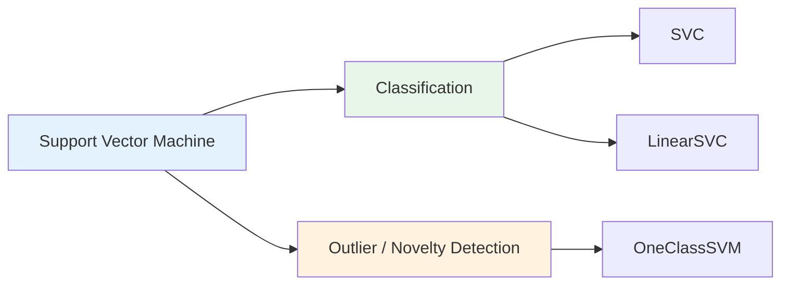
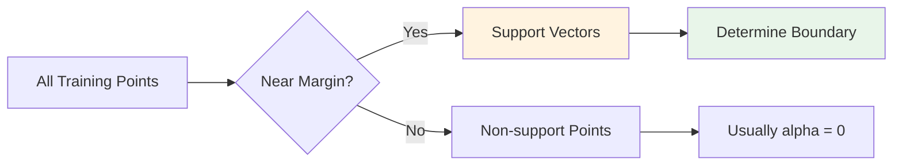
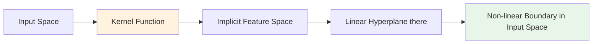
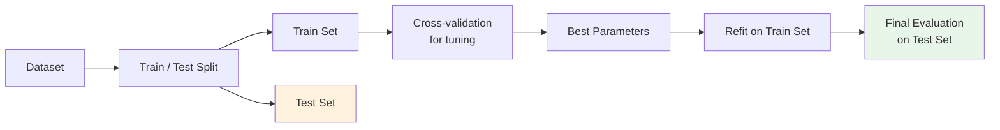
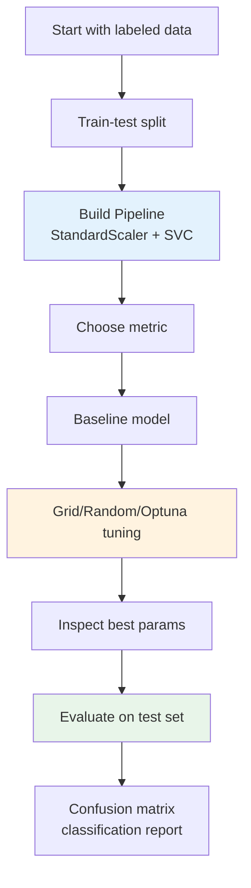

# Support Vector Machine: SVC, Hyperplane, Kernel, dan Parameter Tuning

## Tujuan Pembelajaran

Setelah mempelajari materi ini, mahasiswa mampu:

1. Menjelaskan basic concept Support Vector Machine untuk supervised learning
2. Menjelaskan hyperplane, margin, dan support vectors
3. Membedakan hard margin dan soft margin SVM
4. Menjelaskan intuisi convex optimization pada SVM
5. Menggunakan konsep dasar Support Vector Classification (SVC)
6. Menjelaskan kernel trick dan beberapa kernel function umum
7. Menjelaskan parameter penting pada SVC seperti `C`, `kernel`, `gamma`, `degree`, dan `class_weight`
8. Menentukan parameter SVM dengan Grid Search, Random Search, dan Optuna

## Daftar Isi

1. [Why SVM?](#1-why-svm)
2. [Basic Concept SVM](#2-basic-concept-svm)
3. [Hyperplane, Margin, dan Support Vectors](#3-hyperplane-margin-dan-support-vectors)
4. [Hard Margin vs Soft Margin](#4-hard-margin-vs-soft-margin)
5. [Convex Optimization Intuition](#5-convex-optimization-intuition)
6. [Support Vector Classification](#6-support-vector-classification)
7. [Kernel Trick](#7-kernel-trick)
8. [Kernel Functions](#8-kernel-functions)
9. [Parameter Penting SVC](#9-parameter-penting-svc)
10. [Mencari Parameter Optimal](#10-mencari-parameter-optimal)
11. [Practical Workflow](#11-practical-workflow)
12. [Latihan](#12-latihan)
13. [Referensi](#referensi)

---

## 1. Why SVM?

### Problem di Classification

Dalam classification, kita ingin mencari boundary yang memisahkan class.

Contoh:

```text
Class 0: pasien tidak sakit
Class 1: pasien sakit

Features: usia, tekanan darah, glucose, BMI, dst.
Goal: prediksi class pasien baru
```

Banyak algoritma bisa membuat boundary.

Pertanyaan SVM:

> Dari semua boundary yang bisa memisahkan class, boundary mana yang paling aman untuk generalization?

### Main Idea

SVM memilih boundary yang punya **margin terbesar**.

Margin besar berarti boundary tidak terlalu dekat dengan data training.

```text
Boundary yang terlalu dekat data  -> mudah berubah kalau ada data baru
Boundary dengan margin besar      -> lebih stable dan lebih general
```

### SVM Cocok Untuk

| Kondisi | Kenapa Cocok |
|---|---|
| Feature cukup banyak | SVM efektif di high-dimensional space |
| Data tidak terlalu besar | Kernel SVM butuh komputasi cukup mahal |
| Boundary tidak linear | Kernel bisa membuat non-linear decision boundary |
| Ingin model berbasis margin | SVM eksplisit maximize margin |

### SVM Kurang Cocok Jika

| Kondisi | Risiko |
|---|---|
| Dataset sangat besar | `SVC` bisa lambat karena training scale minimal quadratic terhadap jumlah sample |
| Feature belum di-scale | Fitur dengan range besar bisa mendominasi distance/kernel |
| Butuh probability langsung | `SVC(probability=True)` mahal karena memakai internal cross-validation |
| Banyak noise/outlier | Perlu tuning `C`, kernel, dan preprocessing yang hati-hati |

---

## 2. Basic Concept SVM

### SVM in One Sentence

**Support Vector Machine** adalah metode supervised learning yang mencari **hyperplane** dengan **maximum margin** untuk memisahkan class.

Untuk classification, implementasi yang paling umum di scikit-learn adalah:

```python
from sklearn.svm import SVC

model = SVC(kernel="rbf", C=1.0, gamma="scale")
```

### Taxonomy



Fokus materi ini: **SVC**.

### Intuisi Visual

Bayangkan data 2D dengan dua class.

Ada banyak garis yang bisa memisahkan class.

SVM memilih garis yang:

- memisahkan class dengan benar sebanyak mungkin
- punya jarak terbesar ke point terdekat dari masing-masing class
- boundary-nya ditentukan oleh data paling kritis, yaitu **support vectors**

---

## 3. Hyperplane, Margin, dan Support Vectors

### 3.1 Hyperplane

Hyperplane adalah decision boundary dalam ruang fitur.

| Dimensi Data | Hyperplane Berbentuk |
|---|---|
| 2D | Garis |
| 3D | Bidang |
| >3D | Hyperplane |

Secara matematis:

```text
wᵀx + b = 0
```

where:

- `w` = vector bobot / normal vector
- `x` = feature vector
- `b` = bias / intercept

Prediction rule:

```text
f(x) = sign(wᵀx + b)
```

Jika `f(x) > 0`, masuk class `+1`.
Jika `f(x) < 0`, masuk class `-1`.

### 3.2 Margin

Margin adalah jarak antara hyperplane dengan data terdekat dari setiap class.

SVM ingin:

```text
maximize margin
```

Dengan constraint separasi:

```text
yᵢ(wᵀxᵢ + b) >= 1
```

Jika data linearly separable, margin width berhubungan dengan:

```text
Margin = 2 / ||w||
```

Maka maximize margin setara dengan minimize `||w||`.

Biasanya objective ditulis:

```text
minimize  1/2 ||w||²
```

### 3.3 Support Vectors

Support vectors adalah data points yang berada paling dekat dengan hyperplane.

Mereka penting karena:

- menentukan posisi boundary
- menentukan lebar margin
- jika support vector berubah, model bisa berubah
- data jauh dari margin sering tidak memengaruhi boundary



Dalam scikit-learn, support vectors bisa dilihat dari:

```python
model.named_steps["svc"].support_vectors_
model.named_steps["svc"].n_support_
```

---

## 4. Hard Margin vs Soft Margin

### 4.1 Hard Margin SVM

Hard margin mengasumsikan data bisa dipisahkan sempurna.

Objective:

```text
minimize  1/2 ||w||²

subject to:
yᵢ(wᵀxᵢ + b) >= 1
```

Masalahnya, real-world data jarang clean.

Ada noise, overlap, dan outlier.

### 4.2 Soft Margin SVM

Soft margin memperbolehkan sebagian data:

- masuk ke dalam margin
- bahkan salah klasifikasi

Tapi pelanggaran tersebut diberi penalty.

Objective SVC:

```text
minimize  1/2 ||w||² + C Σᵢ ξᵢ

subject to:
yᵢ(wᵀφ(xᵢ) + b) >= 1 - ξᵢ
ξᵢ >= 0
```

where:

- `ξᵢ` = slack variable, ukuran pelanggaran margin
- `C` = penalty terhadap pelanggaran
- `φ(x)` = mapping ke feature space, eksplisit atau implisit melalui kernel

### 4.3 Interpretasi `C`

| `C` | Efek | Risiko |
|---|---|---|
| Kecil | Margin lebih lebar, lebih toleran error | Bisa underfit |
| Besar | Penalize error lebih kuat | Bisa overfit |

```text
C kecil  -> regularization kuat
C besar  -> regularization lemah
```

Menurut scikit-learn, menurunkan `C` berarti regularization lebih kuat.

---

## 5. Convex Optimization Intuition

### Kenapa SVM Disebut Convex?

SVM training menyelesaikan optimization problem yang convex.

Artinya:

- bentuk objective tidak punya banyak local minima buruk
- solusi global optimum bisa dicari dengan metode quadratic programming
- berbeda dari neural network yang loss surface-nya non-convex

### Convex Problem, Intuitively

Bayangkan bowl shape.


```text
Convex optimization:
    satu lembah utama -> global minimum

Non-convex optimization:
    banyak lembah -> bisa terjebak local minimum
```

Pada SVM, objective punya dua komponen:

| Komponen | Makna |
|---|---|
| `1/2 ||w||²` | Membuat margin besar dan model sederhana |
| `C Σ ξᵢ` | Penalize error / margin violation |

### Hinge Loss View

Soft-margin linear SVM juga bisa dilihat sebagai minimization dari hinge loss.

```text
loss = max(0, 1 - yᵢ(wᵀxᵢ + b))
```

Interpretasi:

- Jika point benar dan jauh di luar margin, loss = 0
- Jika point di dalam margin, loss > 0
- Jika point salah klasifikasi, loss besar

### Kenapa Ini Penting untuk Mahasiswa?

Karena SVM bukan sekadar “fit boundary”.

SVM punya prinsip optimasi jelas:

```text
Find the simplest boundary with maximum margin,
while controlling training mistakes.
```

---

## 6. Support Vector Classification

### 6.1 Apa itu SVC?

**SVC** adalah implementasi SVM untuk classification.

Di scikit-learn:

```python
from sklearn.svm import SVC

svc = SVC(C=1.0, kernel="rbf", gamma="scale")
```

`SVC` berbasis LIBSVM dan mendukung:

- binary classification
- multiclass classification
- linear dan non-linear kernel
- class weighting untuk imbalanced data

### 6.2 Basic Pipeline

SVM sangat sensitif terhadap scale fitur.

Gunakan `Pipeline` agar scaling tidak bocor ke test set.

```python
from sklearn.pipeline import make_pipeline
from sklearn.preprocessing import StandardScaler
from sklearn.svm import SVC

model = make_pipeline(
    StandardScaler(),
    SVC(kernel="rbf", C=1.0, gamma="scale")
)

model.fit(X_train, y_train)
y_pred = model.predict(X_test)
```

Kenapa pipeline?

- scaler fit hanya pada training data
- transform diterapkan konsisten ke validation/test data
- aman dipakai dalam cross-validation dan grid search

### 6.3 Multi-Class SVC

SVM pada dasarnya binary classifier.

Untuk multiclass, `SVC` memakai strategi **one-vs-one** secara internal.

Jika ada `K` class, jumlah classifier binary:

```text
K(K - 1) / 2
```

Contoh:

| Jumlah Class | Jumlah Binary Classifier |
|---|---|
| 2 | 1 |
| 3 | 3 |
| 4 | 6 |
| 10 | 45 |

### 6.4 SVC vs LinearSVC

| Aspek | SVC | LinearSVC |
|---|---|---|
| Backend | LIBSVM | LIBLINEAR |
| Kernel | linear, poly, rbf, sigmoid, custom | linear only |
| Cocok untuk | Small-medium dataset, non-linear boundary | Large dataset, high-dimensional sparse data |
| Support vectors attribute | Ada `support_vectors_` | Tidak sama seperti SVC |
| Scaling | Wajib direkomendasikan | Wajib direkomendasikan |

Rule of thumb:

```text
Butuh non-linear boundary -> SVC(kernel="rbf")
Data sangat besar / text-like -> LinearSVC atau SGDClassifier
```

---

## 7. Kernel Trick

### 7.1 Masalah Linear Boundary

Kadang data tidak bisa dipisahkan dengan garis lurus.

Contoh:

```text
Class A berada di lingkaran dalam
Class B berada di lingkaran luar
```

Di 2D, boundary linear gagal.

Tapi jika data dipetakan ke dimensi lebih tinggi, boundary bisa menjadi linear di ruang baru.

### 7.2 Feature Mapping

Misal kita punya mapping:

```text
φ(x): input space -> feature space
```

SVM bisa belajar hyperplane di feature space:

```text
wᵀφ(x) + b = 0
```

Problem: eksplisit menghitung `φ(x)` bisa mahal atau bahkan infinite-dimensional.

### 7.3 Kernel Trick

Kernel trick memungkinkan kita menghitung inner product di feature space tanpa membuat feature mapping eksplisit.

```text
K(xᵢ, xⱼ) = φ(xᵢ)ᵀφ(xⱼ)
```

Jadi model cukup memakai kernel value antar data points.



### 7.4 Decision Function dengan Kernel

Dalam dual form, prediction bergantung pada support vectors:

```text
f(x) = Σᵢ∈SV αᵢ yᵢ K(xᵢ, x) + b
```

Key insight:

- model tidak perlu semua training points
- hanya support vectors yang muncul di decision function
- kernel menentukan bentuk boundary

---

## 8. Kernel Functions

### 8.1 Common Kernels

| Kernel | Formula | Kapan Dipakai |
|---|---|---|
| Linear | `K(x, z) = xᵀz` | Data linearly separable / high-dimensional sparse |
| Polynomial | `K(x, z) = (γxᵀz + r)^d` | Interaksi fitur sampai degree tertentu |
| RBF | `K(x, z) = exp(-γ ||x - z||²)` | Default kuat untuk non-linear boundary |
| Sigmoid | `K(x, z) = tanh(γxᵀz + r)` | Mirip neural activation, jarang jadi pilihan pertama |

### 8.2 Linear Kernel

```python
SVC(kernel="linear", C=1.0)
```

Cocok jika:

- data cukup linearly separable
- jumlah fitur sangat banyak
- interpretasi feature weight dibutuhkan
- dataset besar dan non-linear kernel terlalu mahal

### 8.3 Polynomial Kernel

```python
SVC(kernel="poly", degree=3, C=1.0, gamma="scale", coef0=0.0)
```

Parameter penting:

- `degree`: derajat polynomial
- `gamma`: skala pengaruh inner product
- `coef0`: independent term

Risiko:

- degree tinggi bisa overfit
- nilai kernel bisa sangat besar
- tuning lebih sulit daripada RBF

### 8.4 RBF Kernel

```python
SVC(kernel="rbf", C=1.0, gamma="scale")
```

RBF sering jadi first choice untuk non-linear SVM.

LIBSVM practical guide merekomendasikan RBF sebagai pilihan awal karena:

- bisa handle non-linear relation
- punya lebih sedikit hyperparameter dibanding polynomial
- kernel value berada pada range stabil
- linear kernel bisa dianggap kasus khusus dalam kondisi tertentu setelah tuning

### 8.5 Sigmoid Kernel

```python
SVC(kernel="sigmoid", gamma="scale", coef0=0.0)
```

Catatan:

- tidak selalu valid sebagai positive semidefinite kernel untuk semua parameter
- jarang menjadi default teaching choice
- gunakan jika ada alasan domain atau eksperimen khusus

---

## 9. Parameter Penting SVC

### 9.1 Parameter Overview

```python
SVC(
    C=1.0,
    kernel="rbf",
    gamma="scale",
    degree=3,
    coef0=0.0,
    class_weight=None,
    probability=False,
)
```

| Parameter | Berlaku Untuk | Makna |
|---|---|---|
| `C` | semua kernel | penalty untuk training error / margin violation |
| `kernel` | semua | jenis similarity function |
| `gamma` | rbf, poly, sigmoid | seberapa jauh pengaruh satu training point |
| `degree` | poly | derajat polynomial |
| `coef0` | poly, sigmoid | independent term pada kernel |
| `class_weight` | classification | bobot class, berguna untuk imbalanced data |
| `probability` | SVC | enable probability estimate, tetapi mahal |

### 9.2 `C`: Margin vs Error

| Nilai `C` | Boundary | Margin | Risiko |
|---|---|---|---|
| Kecil | lebih smooth | lebih lebar | underfit |
| Besar | lebih mengikuti training data | lebih sempit | overfit |

Visual intuition:

```text
C kecil:
  boleh ada beberapa mistake demi margin lebih lebar

C besar:
  mistake dipenalti keras, boundary mengejar training accuracy
```

### 9.3 `gamma`: Local vs Global Influence

`gamma` penting pada RBF kernel.

```text
K(x, z) = exp(-γ ||x - z||²)
```

| Nilai `gamma` | Efek | Risiko |
|---|---|---|
| Kecil | pengaruh point lebih luas, boundary smooth | underfit |
| Besar | pengaruh point sangat lokal, boundary berlekuk | overfit |

scikit-learn default:

```text
gamma="scale" -> 1 / (n_features * X.var())
gamma="auto"  -> 1 / n_features
```

### 9.4 `class_weight`

Untuk imbalanced classification:

```python
SVC(class_weight="balanced")
```

`class_weight="balanced"` memberi bobot lebih besar pada class minoritas.

Gunakan ketika:

- class distribution timpang
- false negative / false positive punya cost berbeda
- accuracy biasa misleading

### 9.5 `probability=True`

```python
SVC(probability=True)
```

Catatan penting:

- SVM decision score bukan probability langsung
- scikit-learn memakai Platt scaling dengan internal cross-validation
- training jadi lebih lambat
- `predict_proba` bisa tidak konsisten dengan `predict`

Jika hanya butuh confidence ranking, gunakan:

```python
model.decision_function(X_test)
```

---

## 10. Mencari Parameter Optimal

### 10.1 Kenapa Parameter Tuning Penting?

SVM sangat dipengaruhi oleh pilihan parameter.

Terutama untuk RBF SVC:

```text
Parameter utama: C dan gamma
```

LIBSVM practical guide merekomendasikan:

1. Scale data
2. Gunakan RBF kernel sebagai baseline non-linear
3. Cari `C` dan `gamma` dengan cross-validation
4. Latih ulang model dengan parameter terbaik pada training data penuh
5. Evaluasi pada test set yang tidak ikut tuning

### 10.2 Jangan Tune di Test Set

Workflow yang benar:



Test set hanya dipakai sekali di akhir.

Jika test set dipakai berkali-kali untuk memilih parameter, performa final akan terlalu optimis.

### 10.3 Grid Search

Grid Search mencoba semua kombinasi parameter dalam grid.

```python
from sklearn.model_selection import GridSearchCV
from sklearn.pipeline import Pipeline
from sklearn.preprocessing import StandardScaler
from sklearn.svm import SVC

pipe = Pipeline([
    ("scaler", StandardScaler()),
    ("svc", SVC())
])

param_grid = [
    {"svc__kernel": ["linear"], "svc__C": [0.1, 1, 10, 100]},
    {"svc__kernel": ["rbf"], "svc__C": [0.1, 1, 10, 100], "svc__gamma": [0.001, 0.01, 0.1, 1]},
]

search = GridSearchCV(
    pipe,
    param_grid=param_grid,
    cv=5,
    scoring="accuracy",
    n_jobs=-1
)

search.fit(X_train, y_train)

print(search.best_params_)
print(search.best_score_)
```

Kapan cocok:

- parameter sedikit
- range sudah cukup jelas
- dataset tidak terlalu besar
- ingin hasil exhaustive dan mudah dijelaskan

### 10.4 Log-Spaced Grid

Untuk `C` dan `gamma`, gunakan skala log.

```python
param_grid = {
    "svc__C": [2**i for i in range(-5, 16, 2)],
    "svc__gamma": [2**i for i in range(-15, 4, 2)],
    "svc__kernel": ["rbf"],
}
```

Kenapa log scale?

Karena perubahan dari `0.001` ke `0.01` bisa lebih meaningful daripada perubahan dari `10.001` ke `10.01`.

LIBSVM guide menyarankan coarse grid terlebih dahulu, lalu fine grid di region yang promising.

### 10.5 Random Search

Random Search sampling kombinasi parameter dari distribusi.

```python
from scipy.stats import loguniform
from sklearn.model_selection import RandomizedSearchCV

param_dist = {
    "svc__kernel": ["rbf"],
    "svc__C": loguniform(1e-3, 1e3),
    "svc__gamma": loguniform(1e-4, 1e1),
}

search = RandomizedSearchCV(
    pipe,
    param_distributions=param_dist,
    n_iter=50,
    cv=5,
    scoring="accuracy",
    n_jobs=-1,
    random_state=42
)

search.fit(X_train, y_train)
```

Kapan cocok:

- search space besar
- budget komputasi terbatas
- ingin eksplorasi awal cepat
- parameter continuous seperti `C` dan `gamma`

Menurut scikit-learn, untuk parameter continuous, gunakan continuous distribution agar random search lebih efektif.

### 10.6 Optuna

Optuna melakukan hyperparameter optimization berbasis trial.

Kita definisikan objective function, lalu Optuna mencoba kombinasi parameter.

```python
import optuna
from sklearn.model_selection import cross_val_score
from sklearn.pipeline import Pipeline
from sklearn.preprocessing import StandardScaler
from sklearn.svm import SVC

def objective(trial):
    C = trial.suggest_float("C", 1e-3, 1e3, log=True)
    gamma = trial.suggest_float("gamma", 1e-4, 1e1, log=True)

    model = Pipeline([
        ("scaler", StandardScaler()),
        ("svc", SVC(kernel="rbf", C=C, gamma=gamma))
    ])

    scores = cross_val_score(model, X_train, y_train, cv=5, scoring="accuracy")
    return scores.mean()

study = optuna.create_study(direction="maximize")
study.optimize(objective, n_trials=50)

print(study.best_params)
print(study.best_value)
```

Kapan cocok:

- search space lebih kompleks
- ingin conditional parameter
- ingin trial-based optimization
- ingin menyimpan history eksperimen

Contoh conditional search:

```python
kernel = trial.suggest_categorical("kernel", ["linear", "rbf", "poly"])
C = trial.suggest_float("C", 1e-3, 1e3, log=True)

if kernel == "rbf":
    gamma = trial.suggest_float("gamma", 1e-4, 1e1, log=True)
elif kernel == "poly":
    degree = trial.suggest_int("degree", 2, 5)
```

### 10.7 Grid Search vs Random Search vs Optuna

| Metode | Cara Kerja | Kelebihan | Kekurangan |
|---|---|---|---|
| Grid Search | Coba semua kombinasi grid | Mudah dijelaskan, exhaustive | Mahal jika kombinasi banyak |
| Random Search | Sampling acak dari distribusi | Budget fleksibel, bagus untuk continuous range | Bisa miss region penting jika trial sedikit |
| Optuna | Trial-based optimization | Fleksibel, conditional search, efficient exploration | Perlu library tambahan dan konsep lebih advanced |

Teaching sequence yang disarankan:

```text
Manual parameter intuition -> Grid Search -> Random Search -> Optuna
```

---

## 11. Practical Workflow

### 11.1 Recommended SVC Workflow



### 11.2 Minimal Code Pattern

```python
from sklearn.datasets import load_breast_cancer
from sklearn.model_selection import train_test_split
from sklearn.pipeline import make_pipeline
from sklearn.preprocessing import StandardScaler
from sklearn.svm import SVC
from sklearn.metrics import classification_report

X, y = load_breast_cancer(return_X_y=True)

X_train, X_test, y_train, y_test = train_test_split(
    X, y, test_size=0.2, stratify=y, random_state=42
)

model = make_pipeline(
    StandardScaler(),
    SVC(kernel="rbf", C=1.0, gamma="scale")
)

model.fit(X_train, y_train)
y_pred = model.predict(X_test)

print(classification_report(y_test, y_pred))
```

### 11.3 Common Mistakes

| Mistake | Dampak | Fix |
|---|---|---|
| Tidak scaling fitur | Feature range besar mendominasi kernel | Pakai `StandardScaler` dalam `Pipeline` |
| Tuning di test set | Evaluasi terlalu optimis | Tune dengan CV pada train set |
| Grid terlalu sempit | Parameter terbaik tidak ketemu | Gunakan log-spaced range luas dulu |
| `C` terlalu besar | Boundary overfit | Coba `C` lebih kecil |
| `gamma` terlalu besar | Boundary terlalu lokal | Coba `gamma` lebih kecil |
| Accuracy untuk imbalance | Metric misleading | Pakai F1, recall, ROC-AUC, atau balanced accuracy |
| `probability=True` tanpa perlu | Training lambat | Pakai `decision_function` jika cukup |

### 11.4 Decision Guide

| Kondisi Data | Pilihan Awal |
|---|---|
| Dataset kecil-menengah, boundary mungkin non-linear | `SVC(kernel="rbf")` |
| Dataset besar dan fitur banyak | `LinearSVC` atau `SGDClassifier` |
| Text classification sparse high-dimensional | Linear model |
| Imbalanced classes | `class_weight="balanced"` + metric yang sesuai |
| Butuh probability calibrated | Pertimbangkan `CalibratedClassifierCV` atau `SVC(probability=True)` dengan biaya tambahan |

---

## 12. Latihan

### Latihan 1: Margin Intuition

Diberikan dua decision boundary yang sama-sama memisahkan class.

Jelaskan boundary mana yang lebih baik menurut SVM dan kenapa.

### Latihan 2: Parameter Effect

Jelaskan efek kombinasi berikut:

| Kombinasi | Prediksi Efek |
|---|---|
| `C` kecil, `gamma` kecil | ? |
| `C` besar, `gamma` kecil | ? |
| `C` kecil, `gamma` besar | ? |
| `C` besar, `gamma` besar | ? |

### Latihan 3: Pipeline

Buat pipeline:

```text
StandardScaler -> SVC
```

Lalu lakukan `GridSearchCV` untuk:

- `kernel`: `linear`, `rbf`
- `C`: `0.1`, `1`, `10`, `100`
- `gamma`: `0.001`, `0.01`, `0.1`, `1` untuk RBF

### Latihan 4: Metric Choice

Jika dataset memiliki class ratio 95:5, kenapa accuracy tidak cukup?

Metric apa yang lebih cocok?

## Referensi

- Cortes, C. & Vapnik, V. (1995). *Support-Vector Networks*. Machine Learning, 20, 273-297.
- Boser, B. E., Guyon, I. M. & Vapnik, V. N. (1992). *A Training Algorithm for Optimal Margin Classifiers*. Proceedings of the Fifth Annual Workshop on Computational Learning Theory.
- Hsu, C.-W., Chang, C.-C. & Lin, C.-J. (2025). *A Practical Guide to Support Vector Classification*. National Taiwan University.
- Chang, C.-C. & Lin, C.-J. (2011). *LIBSVM: A Library for Support Vector Machines*. ACM Transactions on Intelligent Systems and Technology.
- Bergstra, J. & Bengio, Y. (2012). *Random Search for Hyper-Parameter Optimization*. Journal of Machine Learning Research.
- scikit-learn. *Support Vector Machines User Guide*. https://scikit-learn.org/stable/modules/svm.html
- scikit-learn. *SVC API Reference*. https://scikit-learn.org/stable/modules/generated/sklearn.svm.SVC.html
- scikit-learn. *Tuning the hyper-parameters of an estimator*. https://scikit-learn.org/stable/modules/grid_search.html
- scikit-learn. *RandomizedSearchCV API Reference*. https://scikit-learn.org/stable/modules/generated/sklearn.model_selection.RandomizedSearchCV.html
- Optuna. *Pythonic Search Space*. https://optuna.readthedocs.io/en/stable/tutorial/10_key_features/002_configurations.html
